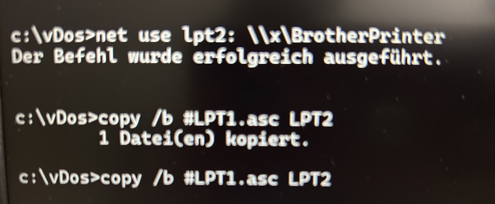
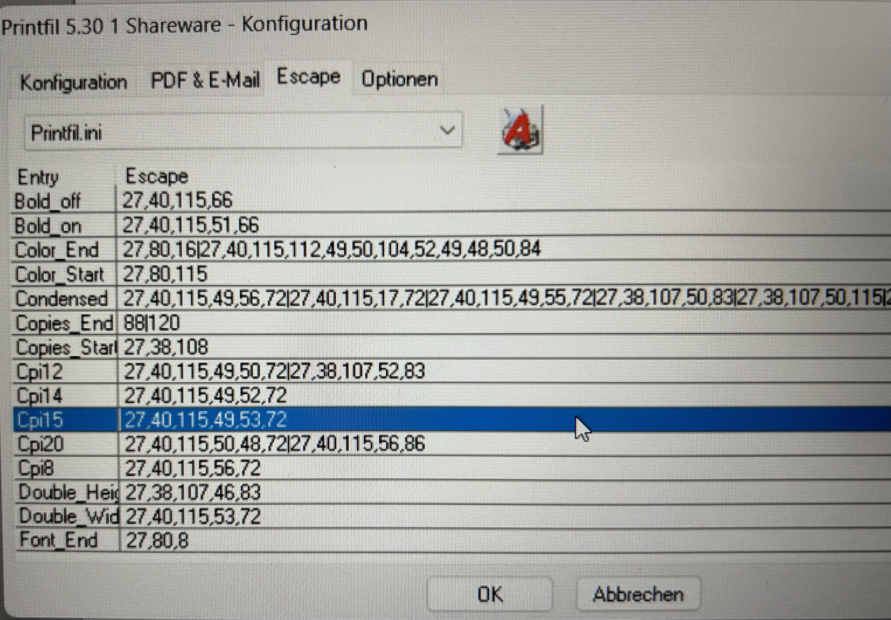
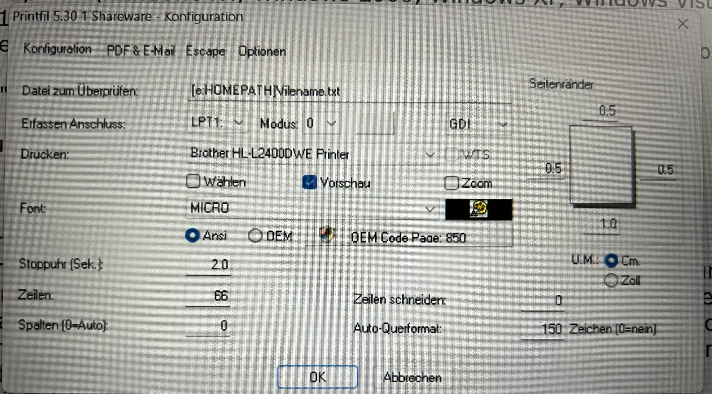
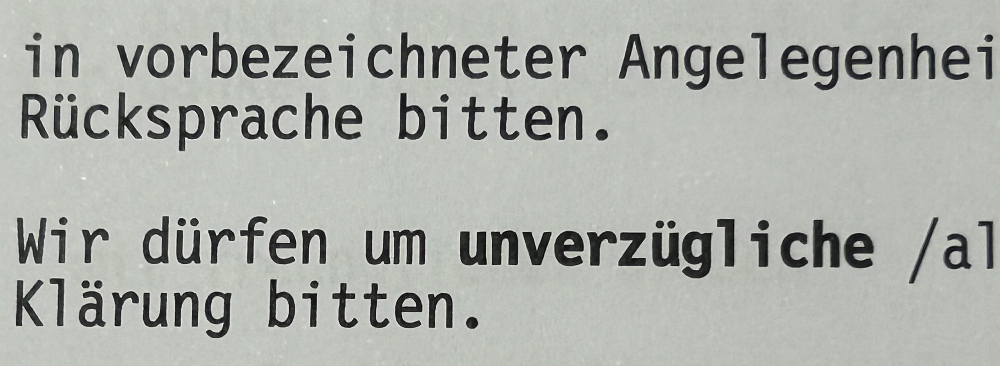
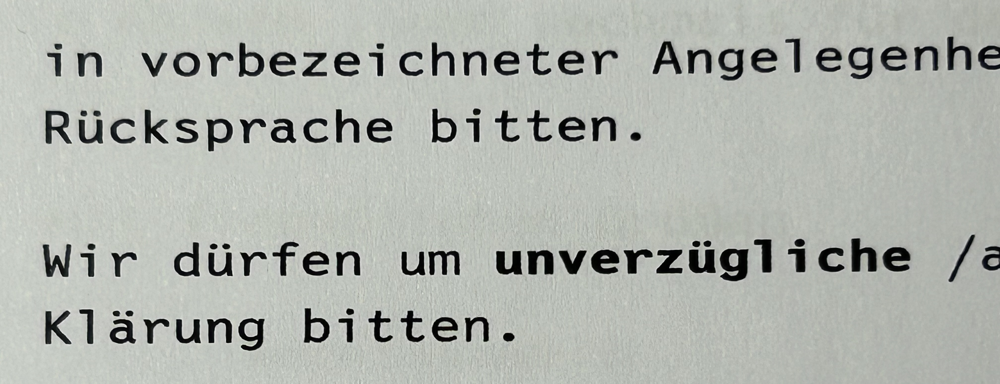
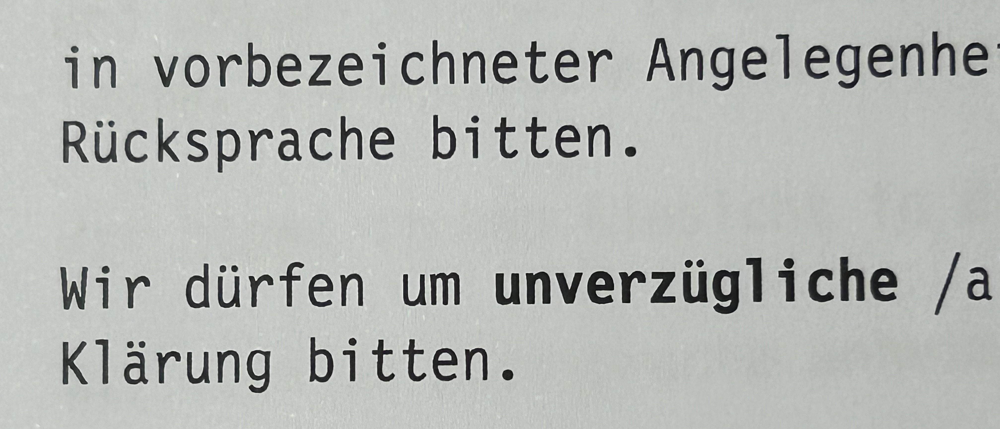
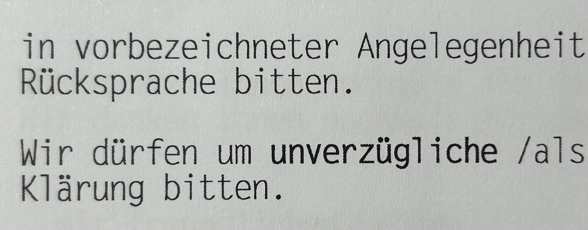
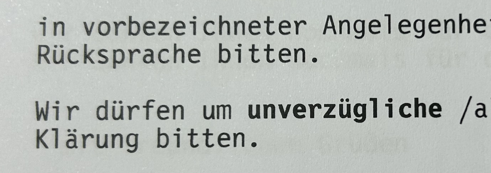

# Problem

Running an old MS-DOS program on a modern Windows environment poses a challenge due to the incompatibility of 32-bit MS-DOS applications with Windows 11.

# Summary

The task at hand involves enabling the execution of a legacy MS-DOS program within a contemporary Windows environment. Various approaches, including virtualization and emulation, are explored to achieve this goal. Each method presents distinct advantages and drawbacks, influencing the decision-making process.

# Possible Solutions

- WindowsXP in VirtualBox
- MSDOS in VirtualBox
- DOSBOX
- vDOS

**Links:**
- [Emulators and compatibility layers for old software](https://mendelson.org/emulators.html)

## WindowsXP in VirtualBox

Utilizing a virtual machine running Windows XP provides a sandboxed environment for legacy software execution. However, issues such as registration failure and limited printer setup impede seamless functionality.

**Pros:**
- Runs in a virtual environment, ensuring isolation from the host system.

**Cons:**
- Registration difficulties due to unresponsive registry server.
- Suboptimal performance and inability to configure printers.
- Restricted smaller display resolution, causing border issues.

**Links:**
- n/a

## MSDOS in VirtualBox

Not tested

**Pros:**
- n/a

**Cons:**
- n/a

**Links:**
- https://www.instructables.com/How-To-Install-DOS-622-Under-VirtualBox/

## DOSBOX

DOSBox, an x86 emulator with DOS support, offers compatibility for running MS-DOS applications. Despite functional capability, performance issues may arise, particularly during user interaction.

**Pros:**
- Application functionality is preserved.

**Cons:**
- Performance degradation observed during operation and input processing.

**Links:**
- https://www.dosbox.com/


## vDOS

vDOS emerges as a promising solution due to its efficiency and customizable printing options. However, discrepancies in print output compared to the original font raise concerns.

**Pros:**
- Efficient execution with minimal input delay.
- Configurable printing settings enhance usability.

**Cons:**
- Printouts deviate from original font aesthetics.

**Links:**
- https://vdos.proboards.com/
- https://www.vdos.info/

## Decision: vDOS

The final choice gravitates towards vDOS due to its favorable performance characteristics and printing flexibility.


# Printing

Printing from vDOS can sometimes present challenges, particularly when it comes to font selection and output quality. This comprehensive guide explores various methods and tools for printing from vDOS, addressing common issues and providing detailed insights into each solution.

## List printers in Windows

Before delving into printing solutions, it's crucial to have a clear understanding of the available printers on your Windows system. Utilize the following commands to list printers:

```shell
wmic printer list brief
wmic printer list full
wmic printer get name

```

## direct printing in vDOS

Direct printing in vDOS offers the advantage of simplicity, requiring no additional setup. However, users may encounter issues with printouts not being comparable to the original due to font condensation.

**Pros:**
- No setup required.

**Cons:**
- Printouts may not match the original.

**Links:**
- See the `Printing.pdf` in the setup directory for more information.

## RAW Printing in vDOS

Utilizing RAW printing in vDOS, especially if the printer supports PCL, can be straightforward. However, issues may arise with the Windows print spooler refusing to print the PCL output.

**Commands:**

```text
lpt3 = PRIVATE SEL: "Windows_PCL_printer" RAW
```

**Pros:** 
- No additional software required.

**Cons:**
- Windows print spooler may refuse PCL output.

**Links:**
- See the `Printing.pdf` in the setup directory for more details.

## RAW printing in console

While RAW printing in the console doesn't require additional installations, users need to assign the LPT with net use, and errors might occur during printing.




**Commands:**
```shell
print /D:"My Brother printer" #LPT1.asc 
Printer can not initialized
```

**Setup:**
Assign LPT2 to the printer
- enable sharing of the printer. for example: `\\x\BrotherPrinter`
- assign the printer:
```shell
net use lpt2: \\x\BrotherPrinter
copy /b #LPT1.asc LPT2
```

**Pros:**
- No need for additional software installations.

**Cons:**
- Requires assigning LPT with net use.
- Potential errors during printing.

**Links:**
- n/a

## DOSprn

DOSprn presents an interesting solution at a reasonable price. It offers font selection and manipulation but may trigger annoying additional confirmation errors in vDOS.

**Pros:**
- Affordable at 15USD.
- Font selection and manipulation.
  (font,size,CPI/LPI)
- Supports HP PCL escape sequences.
- Precise page margins.

**Cons:**
- Annoying confirmation errors in vDOS, because it called a wrapper and changed the vDOS program name. 
- Font scaling issues: the font size is ignored.

**Links:**
- https://www.dosprn.com/

## PDFtoPrinter

PDFtoPrinter provides a comprehensive solution, including PCL6 support, in a single executable without requiring GhostPCL installation. However, it may result in very thin font printing.


**Pros:**
- All-inclusive solution.
- Single executable with included GhostPCL dependency.

**Cons:**
- Thin font printing.

**Links:**
- [PDFtoPrinter](https://mendelson.org/pdftoprinter.html)

## GhostPCL

GhostPCL, while functional, requires a complicated installation process with SumatraPDF. Additionally, it may necessitate manual file replacement and renaming for default page size settings.

**Configuration:**

- add `PCLPPRINT.bat`:

```shell
@echo off
pcl6.exe -dNOPAUSE -dBATCH -sDEVICE=pdfwrite -sOutputFile=PCLPRINT.PDF "%1"
SumatraPDF-3.4.6-64.exe -print-settings "paper=A4,fit,bin=300" -print-to "\\Server\Printer" PCLPRINT.PDF
del PCLPRINT.PDF
```
or

```shell
@echo off
cd /d %~dp0
pcl6.exe -dNOPAUSE -dBATCH -sDEVICE=pdfwrite -sOutputFile=PCLPRINT.PDF "%1"
SumatraPDF.exe -print-to-default PCLPRINT.PDF
del PCLPRINT.PDF
```
- add this lines to `config.txt`:
```text
LPT1 = "C:\vDOS\pclprint.cmd" #LPT1.ASC
```

**Pros:**
- Functional solution.

**Cons:**
- Installation process is complicated.
- GhostPCL requires searching for newer PCL files to function properly out of the box.
- To set A4 as the default page size, the pcl6 needs to be replaced and renamed.
- Printing results in very thin fonts.

**Links:**
- [setup instructions](https://sourceforge.net/p/vdos/discussion/printing/thread/86dc4dfa/)
- [Print GhostPCL PDF directly into a specific Printer](https://vdos.proboards.com/thread/625/print-ghostpcl-pdf-specific-printer)
- [GhostPCL](https://mendelson.org/ghostpcl.html)
- [SumatraPDF](https://www.sumatrapdfreader.org/download-free-pdf-viewer)

## Printfil

Printfil offers better font visibility and no GUI during printing but may require additional configuration for HP PCL printing and faces commercial pricing.

**Configuration:**

- Format: GDI
- Escape sequences:
```text
Bold off: 27,40,115,66
Bold on: 27,40,115,51,66
Color End: 27,80,16|27,40,115,112,49,50,104,52,49,48,50,84
```
*Note: Escape sequences can be located by right-clicking on the printfil icon in the menu bar, then selecting "Help -> Dump: Redo Last Print" ([Find Printfil Tray Icon](https://www.printfil.com/tray-icon.htm)). This action produces an [example PDF](https://www.printfil.com/download/testpf3.pdf).*
- Wait time: `0.1` (restart needed)




**Pros:**
- Improved font visibility.
- No GUI during printing.

**Cons:**
- Additional configuration for HP PCL printing is needed.
- pricing: Commercial 79€ / Personal 49€ ([FAQ: License](https://www.printfil.com/efaq12.htm))
- The PCL printing engine recommends installing GhostPCL, but it consistently fails to detect the installed files, resulting in an ongoing error message prompting for installation.

**Links:**
- https://www.printfil.com/
- https://www.printfil.com/manualen/c3.htm
- https://www.printfil.com/vdos-printing.htm
- [HP PCL code file](https://www.printfil.com/download/hp.seq)
- [FAQ: Find Printfil Tray Icon](https://www.printfil.com/tray-icon.htm)
- [FAQ: License](https://www.printfil.com/efaq12.htm)

## not tested

- https://mendelson.org/windowsrawprint.html
- https://www.dosprinter.net/

# Fix Font

Upon transferring a font from a previous Windows PC to vDOS, you encountered an issue where vDOS failed to utilize the font. This led you to investigate the font's location within the Windows environment to troubleshoot the matter comprehensively.


### List Fonts on Windows

The fonts can be found within these directories:
- system-wide font: `C:\Windows\Fonts`
- per-user font: `C:\Users\Username\AppData\Local\Microsoft\Windows\Fonts`

To inspect the fonts installed in the system-wide repository, execute the following command: 
```shell
reg query "HKLM\SOFTWARE\Microsoft\Windows NT\CurrentVersion\Fonts" /s
```

**Links:**
- https://ss64.com/nt/reg.html


### Glyph Studio

Glyph Studio emerged as a viable solution for modifying font attributes, allowing you to address issues such as font naming discrepancies.


**Pros:**
- No setup is required; it's an online internet-based font editor.

**Cons:**
- Uncertainty regarding stability, potentially introducing reliability concerns during prolonged usage.

**Links:**
- Info: https://www.glyphrstudio.com/
- Editor: https://www.glyphrstudio.com/app

### Font Forge

Font Forge presents an advanced toolset for intricate font manipulation tasks, albeit requiring additional installation steps and exhibiting unconventional GUI behavior.

**Pros:**
- Empowers users with a comprehensive suite of font editing functionalities.

**Cons:**
- Imposes an additional installation burden, necessitating extra steps for integration.
- Non-native GUI behavior, characterized by limited copy-paste functionality, may disrupt user workflow and familiarity.

**Links:**
- https://fontforge.org/en-US/

# macOS

Transitioning to macOS necessitates compatible environments for DOS applications, facilitated by specialized emulation software like DOSBOX-X and vDosMac.

## DOSBOX-X

To install DOSBOX-X on macOS, consider utilizing the Homebrew package manager with the --cask option for streamlined integration:

```shell
brew install --cask dosbox-x
```

**Pros:**
- Streamlined installation process via Homebrew, enhancing user convenience.

**Cons:**
- When using any DOSBOX for Mac, I encounter an error when attempting to open my program, specifically, an internal license check failure. It seems there's a minor issue with this check since all other functionalities are operational. However, I'm unable to access the text editor portion due to the "missing" license error.

**Links:**
- https://dosbox-x.com/

## vDosMac

vDosMac stands out for its remarkable typing performance, catering to users seeking efficient text input capabilities on macOS environments.

**Pros:**
- Exceptional typing speed enhances user productivity and typing efficiency.

**Cons:**
- Unable to directly print the format from the program - error: no PCL/PostScript format available.
- Lack of a Homebrew cask recipe complicates the installation process, potentially deterring users seeking streamlined software management.

**Links:**
- https://mendelson.org/vdosmac.html


# Print tests

1. Original printout:

2. vDOS printout:

3. Wordpad printout:

4. PDF printout:

5. Printfil printout:


